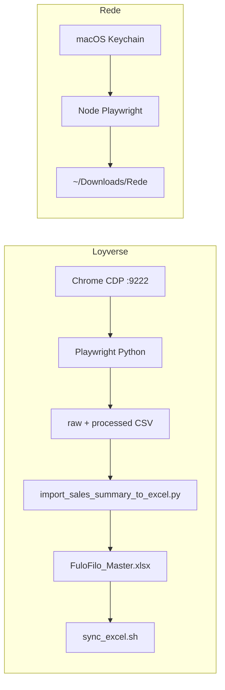

# FulôFiló — Automations User Guide

_Last updated: 2026-06-02_

This guide explains how to run **Loyverse** and **Rede** sales automations after cloning [fulofilo-analytics](https://github.com/AUTOGIO/fulofilo-analytics), and how to fix the errors you are most likely to see.

For the full Excel → dashboard pipeline, see [USER_GUIDE.md](USER_GUIDE.md).

---

## 1. What these automations do

| Automation | What it downloads | Where data goes | Imported into Excel? |
|------------|-------------------|-----------------|---------------------|
| **Loyverse** | Item sales summary (goods report) per day | `automations/loyverse-data/raw/` and `processed/` | **Yes** — updates `DailySales` in `FuloFilo_Master.xlsx`, then `sync_excel.sh` refreshes parquet/DuckDB |
| **Rede** | Sales report (CSV / Excel / PDF) | `~/Downloads/Rede` by default | **No** — files stay in Downloads for manual use or other tools |

Both automations are **bundled inside this repo** under `automations/`. You do not need separate GitHub checkouts.



---

## 2. Prerequisites

| Requirement | Loyverse | Rede |
|-------------|----------|------|
| macOS | Recommended (Keychain, Terminal launcher) | **Required** (Keychain credentials) |
| Python 3.10+ and `uv sync` | Yes | Only if launching via dashboard/CLI |
| Node.js + npm | No | Yes |
| Google Chrome | Yes (dedicated profile) | No (bundled Chromium) |
| Internet + portal login | Yes | Yes |
| Excel master workbook | `data/excel/FuloFilo_Master.xlsx` | Not required for download only |

---

## 3. First-time setup (any computer)

Run everything from the **repository root**:

```bash
git clone https://github.com/AUTOGIO/fulofilo-analytics.git
cd fulofilo-analytics
uv sync
bash scripts/setup_automations.sh
```

What `setup_automations.sh` does:

1. Creates `automations/loyverse-data/{raw,processed,logs,chrome-profile}`
2. Creates Rede log/profile folders under `automations/rede-automation/`
3. Runs `npm install` and `npx playwright install chromium` for Rede
4. Runs `playwright install chromium` for Loyverse (Python), if `.venv` exists

Optional path overrides (copy from `.env.automations.example` or export in shell):

```bash
export LOYVERSE_DATA_ROOT="$(pwd)/automations/loyverse-data"
export REDE_AUTOMATION_ROOT="$(pwd)/automations/rede-automation"
export REDE_DOWNLOAD_DIR="$HOME/Downloads/Rede"
```

Verify setup:

```bash
test -d automations/rede-automation/node_modules && echo "Rede npm: OK"
test -x .venv/bin/python3 && .venv/bin/python3 -c "import playwright; print('Loyverse Playwright: OK')"
```

---

## 4. Loyverse automation

### 4.1 One-time: Chrome with Loyverse session

Loyverse uses **Chrome DevTools Protocol** on port **9222**. You must use the **automation profile**, not your normal Chrome.

1. **Quit** any Chrome window that was started with the same `--user-data-dir` (or use a different machine profile path).

2. Start Chrome:

```bash
cd fulofilo-analytics
/Applications/Google\ Chrome.app/Contents/MacOS/Google\ Chrome \
  --remote-debugging-port=9222 \
  --user-data-dir="${LOYVERSE_DATA_ROOT:-$(pwd)/automations/loyverse-data}/chrome-profile"
```

3. In that window only, open Loyverse and **log in**. Leave this window open while downloads run.

4. Do **not** use Safari or a regular Chrome window without port 9222 — automation will not connect.

### 4.2 Download and import one day

```bash
cd fulofilo-analytics
.venv/bin/python3 scripts/automation_cli.py download-loyverse-daily-sales \
  --date 2026-06-02 --format csv
```

On success you should see status `validated` and files under:

- `automations/loyverse-data/raw/loyverse_goods_daily_YYYY-MM-DD.csv`
- `automations/loyverse-data/processed/loyverse_goods_daily_YYYY-MM-DD.csv`
- `data/raw/item_sales_summary_YYYY-MM-DD_YYYY-MM-DD.csv` (copy for import)

If sync did not run automatically:

```bash
bash scripts/sync_excel.sh
```

### 4.3 Backfill missing working days (Mon–Sat)

```bash
.venv/bin/python3 scripts/automation_cli.py backfill-missing-loyverse-sales \
  --from 2026-03-01 --to 2026-06-01 \
  --format csv --continue-on-error
bash scripts/sync_excel.sh
```

Flags:

| Flag | Default | Meaning |
|------|---------|---------|
| `--skip-existing` | on | Skip days that already have a non-empty raw/processed file |
| `--continue-on-error` | on | Keep going if one day fails |
| `--sync-each-day` | on | Run `sync_excel.sh` after each imported day (slower, safer) |
| `--force` | off | Re-download even if files exist |

### 4.4 From the Streamlit dashboard

1. Start the app: `bash scripts/launch_app.sh`
2. In the sidebar, use **Baixar + importar Loyverse** (same CLI pipeline).
3. Chrome on port 9222 must already be running with Loyverse logged in.

### 4.5 Loyverse logs

JSONL logs per run:

```text
automations/loyverse-data/logs/loyverse_goods_daily_YYYY-MM-DD_csv_<timestamp>.jsonl
```

Automation CLI logs:

```text
logs/automation/download-loyverse-daily-sales.log
logs/automation/backfill-missing-loyverse-sales.log
```

---

## 5. Rede automation

### 5.1 One-time: macOS Keychain credentials

```bash
security add-generic-password -a "rede-email" -s "rede-automation-email" -w "YOUR_EMAIL" -U
security add-generic-password -a "rede-password" -s "rede-automation-password" -w "YOUR_PASSWORD" -U
```

Verify (prints password — run only in private terminal):

```bash
security find-generic-password -s rede-automation-email -w
```

### 5.2 Run from Terminal (recommended for CAPTCHA / 2FA)

```bash
cd fulofilo-analytics/automations/rede-automation
npm run rede:vendas -- --yesterday
npm run rede:vendas -- --today
npm run rede:vendas -- --date 2026-05-23 --formats csv,excel,pdf
```

Behavior:

- Opens a **visible** Chromium window.
- If CAPTCHA, token, or 2FA appears, complete it in the browser, then press **ENTER** in Terminal when prompted.
- Downloads go to `~/Downloads/Rede` (or `REDE_DOWNLOAD_DIR`).
- Files are named like `Rede_Rel_Vendas_YYYY-MM-DD.csv`. Existing files are not overwritten (timestamp suffix if needed).

### 5.3 Launch from FulôFiló CLI (opens new Terminal window)

```bash
cd fulofilo-analytics
.venv/bin/python3 scripts/automation_cli.py launch-rede-sales-download \
  --date 2026-06-01 --formats csv
```

This creates a `.command` launcher under `automations/rede-automation/.dashboard-launchers/` and opens it with macOS `open`.

### 5.4 Rede logs and debug artifacts

| Path | Contents |
|------|----------|
| `automations/rede-automation/logs/rede-vendas.log` | Main text log |
| `automations/rede-automation/logs/debug/` | Screenshots + HTML snapshots on UI failures |

### 5.5 Before each Rede run

- Close any **previous** Rede automation Chromium window (only one persistent profile session at a time).
- Confirm Keychain entries exist.
- Run from `automations/rede-automation` or via CLI so `REDE_AUTOMATION_ROOT` resolves correctly.

---

## 6. Automation CLI reference

All commands run from the repo root with `.venv/bin/python3 scripts/automation_cli.py <command>`.

| Command | Purpose |
|---------|---------|
| `download-loyverse-daily-sales --date YYYY-MM-DD` | One Loyverse day + Excel import + sync |
| `backfill-missing-loyverse-sales --from … --to …` | Fill gaps (working days) |
| `download-loyverse-sales-period --from … --to …` | Period download (day by day) |
| `launch-rede-sales-download --date YYYY-MM-DD` | Open Terminal Rede job |
| `refresh-dashboard-data` | Sync Excel → parquet/DuckDB |
| `run-daily-automation` | Sync + alerts + reports (no Loyverse/Rede) |

Makefile shortcuts: `make setup-automations`, `make automation-run-daily`, etc.

Common flags:

- `--force` — ignore idempotency / re-download
- `--format csv|xlsx|pdf` — Loyverse export type (PDF downloads only; no Excel import)

---

## 7. Troubleshooting

### 7.1 Setup and environment

| Symptom | Likely cause | Solution |
|---------|--------------|----------|
| `npm not found` during `setup_automations.sh` | Node.js not installed | Install Node.js LTS from [nodejs.org](https://nodejs.org/), rerun `bash scripts/setup_automations.sh` |
| `Warning: .venv not found` | Python env not created | Run `uv sync`, then rerun `bash scripts/setup_automations.sh` |
| `Playwright is not installed` | Chromium browser binaries missing | `uv sync` then `.venv/bin/python3 -m playwright install chromium` |
| `Rede automation not found at … Run: bash scripts/setup_automations.sh` | Missing `automations/rede-automation` or `node_modules` | Clone latest `main`, run `bash scripts/setup_automations.sh` |
| `Missing Python runtime: …/.venv/bin/python3` | Virtualenv absent | `uv sync` from repo root |

### 7.2 Loyverse errors

| Error message | Likely cause | Solution |
|---------------|--------------|----------|
| `browser not open for automation. Start Chrome with: …` | Chrome not listening on **9222**, or wrong profile | Quit other Chrome instances using the same profile; start Chrome with the exact command in [§4.1](#41-one-time-chrome-with-loyverse-session) |
| `Loyverse session expired. Log in manually, then retry.` | Not logged in or session timed out | In the **9222 Chrome window**, log in to Loyverse again, reload dashboard, retry download |
| `export button not found` | Wrong page, slow load, or UI change | Open goods report manually in that Chrome window; wait for chart to load; retry. Check Loyverse UI language (Exportar / Export) |
| `download timeout` | Network slow or export dialog stuck | Retry; confirm export format menu appears after clicking Export |
| `downloaded file has no importable sales rows` | Empty day or wrong report | Confirm date range in Loyverse URL matches `--date`; check CSV has rows with SKU and quantity > 0 |
| `unsupported format for import; use csv or xlsx` | Used PDF | Re-run with `--format csv` or `xlsx` for Excel import |
| `import_sales_summary_to_excel failed: …` | SKU/catalog mismatch or bad CSV | Read stderr in Loyverse JSONL log; ensure SKUs in export exist in Excel `Catalog` sheet |
| `sync_excel failed: …` | Validation errors in master workbook | Run `bash scripts/sync_excel.sh` alone and read `data/excel/source_sync_status.json` |
| `Existing file is empty: …` | Corrupt prior download | Delete the empty file under `raw/` or re-run with `--force` |
| `invalid date: expected YYYY-MM-DD` | Bad `--date` | Use ISO date, e.g. `2026-06-02` |
| Backfill skips all days | Days already covered | Expected if files exist; use `--force` to re-download specific days |
| KPI charts look wrong after backfill | Multi-day cumulative CSV used as one day | Use **one file per calendar day** (`item_sales_summary_YYYY-MM-DD_YYYY-MM-DD.csv`) |

**Chrome port already in use**

```bash
lsof -i :9222
```

Kill the stale process or use only one automation Chrome instance.

**Wrong Chrome profile**

Symptom: connects but Loyverse is logged out every time.

Fix: Always pass `--user-data-dir=…/automations/loyverse-data/chrome-profile`. Do not mix with daily browsing profile.

### 7.3 Rede errors

| Symptom | Likely cause | Solution |
|---------|--------------|----------|
| `Rede credentials were not found in macOS Keychain` | Missing or wrong service names | Run the `security add-generic-password` commands in [§5.1](#51-one-time-macos-keychain-credentials) exactly (`rede-automation-email`, `rede-automation-password`) |
| `Another Rede automation browser is already running` | Previous Chromium still open | Close the Rede automation browser window; wait a few seconds; rerun |
| `Could not find the Rede login submit button` | Login page layout changed | Complete login manually in the visible browser; check `logs/debug/*-missing-email-input.png` |
| `Could not find the Rede date filter` / `Could not select day` | Calendar UI change or wrong month | Use screenshot in `logs/debug/`; pick date manually in browser if needed, then rerun |
| `Could not find #download-start or baixar button` | Report page not loaded | Navigate to sales report in open browser; dismiss modals (“novidades”); rerun |
| `Download did not appear in … within N seconds` | Slow portal or blocked download | Check `~/Downloads/Rede`; increase patience; rerun with fewer formats (`--formats csv` only) |
| `Invalid formats` | Typo in `--formats` | Use `csv`, `excel`, and/or `pdf` comma-separated |
| Portal asks for CAPTCHA / 2FA | Security step | Complete in browser, press **ENTER** in Terminal when script waits |
| `Unsupported Rede format(s)` from CLI launcher | Invalid format in dashboard | Use `csv`, `excel`, or `pdf` only |

### 7.4 Automation CLI / locks

| Symptom | Likely cause | Solution |
|---------|--------------|----------|
| `Action '…' is already running (lock file: …)` | Previous run crashed without releasing lock | Check `data/automation/locks/`; if no process is running, delete the stale `*.lock` file |
| `Could not acquire lock` | Race or stale lock | Same as above |
| Command succeeds but dashboard unchanged | Sync not run | Run `bash scripts/sync_excel.sh` or `make automation-refresh-dashboard-data` |
| Loyverse OK but `ok=false` in CLI | See `message` in JSON output | Open `logs/automation/<action>.log` and Loyverse JSONL log for that date |

### 7.5 Excel / data quality after Loyverse import

| Symptom | Likely cause | Solution |
|---------|--------------|----------|
| Sync warnings about blank `sku` | POS lines without SKU | Fix SKUs in Loyverse or map in `CategoryOverrides`; see [USER_GUIDE.md](USER_GUIDE.md) validation policies |
| Duplicate sales rows | Re-import same day without care | Prefer idempotent re-run; review `DailySales` in Excel before sync |
| `Could not find YYYY-MM-DD date range in filename` | Wrong processed file name | Ensure file matches `item_sales_summary_YYYY-MM-DD_YYYY-MM-DD.csv` |

---

## 8. Quick recovery checklist

When anything fails, work through this list in order:

1. **Repo root** — `pwd` shows `fulofilo-analytics`.
2. **Python** — `uv sync` and `.venv/bin/python3 --version`.
3. **Automations** — `bash scripts/setup_automations.sh` (once per machine).
4. **Loyverse** — Chrome on `:9222` with bundled profile; logged in.
5. **Rede** — Keychain entries; no other Rede browser open.
6. **Logs** — Loyverse JSONL, `logs/automation/*.log`, Rede `logs/rede-vendas.log`, Rede `logs/debug/`.
7. **Sync** — `bash scripts/sync_excel.sh` and read `data/excel/source_sync_status.json`.
8. **Dashboard** — `bash scripts/launch_app.sh` and refresh browser.

---

## 9. Security notes

- Never commit `.env` files with passwords.
- Rede passwords live in **macOS Keychain**, not in the repo.
- Loyverse uses an isolated Chrome profile under `automations/loyverse-data/chrome-profile/` (gitignored).
- Rede download folder is outside the repo by default (`~/Downloads/Rede`).

---

## 10. Related documentation

- [USER_GUIDE.md](USER_GUIDE.md) — Full pipeline, n8n, daily ops
- [automations/README.md](../automations/README.md) — Short reference
- [automations/rede-automation/README.md](../automations/rede-automation/README.md) — Rede-only commands
- [automations/loyverse-data/README.md](../automations/loyverse-data/README.md) — Data folder layout
