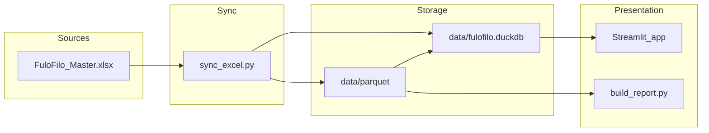

# DELIVERABLE 1 — PROFESSIONAL REPORT

**FulôFiló Analytics Pro** — Enterprise technical and operational report  
**Target environment:** Apple Silicon (iMac M3 class), macOS, local-first, offline-capable  
**Document version:** 1.0 (aligned with repository state as of implementation)

---

## Repository alignment notice (read first)

| Mode | Description | Status in this repository |
|------|-------------|---------------------------|
| **Target operating model** | Single Excel master at `data/excel/FuloFilo_Master.xlsx`, sync via `scripts/sync_excel.sh` → Parquet → DuckDB → Streamlit | **Implemented:** [`sync_excel.py`](../scripts/sync_excel.py), [`sync_excel.sh`](../scripts/sync_excel.sh), [`bootstrap_excel_master.py`](../scripts/bootstrap_excel_master.py); workbook from bootstrap or operations |
| **Alternate refresh path** | Eleve JSON + ETL: `scripts/refresh_data.sh` runs `etl/build_catalog.py` → `etl/ingest_eleve.py` → `etl/categorize_products.py` | **Present** when the catalog is driven from `dashboard_data.json` instead of the Excel master |

**Note:** Use **`bash scripts/sync_excel.sh`** after editing the Excel master; use **`./scripts/refresh_data.sh`** when refreshing from Eleve JSON and the embedded catalog pipeline. Do not assume both are run on the same day unless you intentionally merge workflows.

---

## 1. Executive Summary

**What it is:** FulôFiló Analytics Pro is a retail analytics and business intelligence stack: operators maintain business data (target: Excel master; current repo: raw JSON/CSV + ETL), analytical layers materialize as **Parquet** files and a local **DuckDB** database, and a **Streamlit** dashboard with **Plotly** visualizations provides read-mostly insight, plus **openpyxl**-based Excel report export.

**Why it matters:** It concentrates catalog, sales, inventory, margin, and cashflow signals in one place for daily decisions (ABC prioritization, stock alerts, margin quadrants) without mandatory cloud dependency.

**How it works:** Data flows from sources → validated/transformed → `data/parquet/*.parquet` → DuckDB views (`app/db.py`) → Streamlit pages (`app/app.py`, `app/pages/*`).

**How to use it:** `uv sync` → refresh data (`./scripts/refresh_data.sh` today) → `./scripts/launch_app.sh` or double-click `FuloFilo.command` → optional `uv run python excel/build_report.py` or dashboard page **Exportar Excel**.

**What can fail:** Missing `.venv`, missing or stale Parquet, invalid Eleve JSON schema, pytest expectations not met, port 8501 already in use.

**How to fix it:** See §17 Troubleshooting Matrix and §18 Installation Guide.

---

## 2. Business Purpose

| Stakeholder need | System response |
|------------------|-----------------|
| See revenue, units, profit, margin, ticket | Home page KPIs (`get_summary_kpis`) |
| Focus on top contributors (Pareto) | ABC analysis (A/B/C by cumulative revenue) |
| Balance volume vs margin | Margin matrix quadrants (Stars, Cash Cows, Hidden Gems, Dogs) |
| Avoid stockouts | Inventory alerts and turnover (`get_inventory_alerts`, `get_stock_turnover`) |
| Daily sales capture | **Operações Diárias** page: CSV append + Parquet rebuild + inventory hooks |
| Category hygiene | **Categorias** page + `etl/categorize_products.py` + `product_catalog_categorized.csv` |
| Shareable artifacts | 9-sheet Excel via `excel/build_report.py` / page 06 |

---

## 3. System Overview

**What it is:** Three layers — **ingestion/ETL**, **analytical storage**, **presentation**.

**Why it matters:** Separation keeps the dashboard fast (columnar Parquet + DuckDB) while allowing batch regeneration from sources.

**How it works:**

1. **Ingestion:** Build/enrich catalog, ingest Eleve-shaped JSON, categorize products (see §9).
2. **Storage:** Parquet files under `data/parquet/`; DuckDB file `data/fulofilo.duckdb` with views pointing at Parquet.
3. **Presentation:** Streamlit reads via DuckDB; cache invalidation uses latest Parquet mtime fingerprint (`get_data_mtime`).

**How to use:** After any source change, rerun refresh (or future `sync_excel.sh`), then reload the app.

**What can fail:** Stale cache if Parquet timestamps do not change; empty views if files missing.

**How to fix:** Touch/regenerate Parquet; call `load_*` with fresh `get_data_mtime()` (already wired in pages).

---

## 4. Architecture Diagram

### 4.1 Target architecture (Excel master — per project contract)



### 4.2 Implemented architecture (current repository)

```text
  ~/Documents/FuloFilo_Inbox/*.json  (optional)
            |  copy/move
            v
  data/raw/dashboard_data.json
            |
            v
  etl/build_catalog.py  ---------> data/parquet/products.parquet
            |                      data/raw/product_catalog.csv
            v
  etl/ingest_eleve.py   ---------> revenue/quantity/profit_report.parquet
            |                      daily_sales, inventory, cashflow (as implemented)
            v
  etl/categorize_products.py ---> data/raw/product_catalog_categorized.csv
            |
            v
  data/parquet/*.parquet
            |
            v
  DuckDB views (app/db.py) -----> Streamlit (app/app.py + pages)
            |
            v
  excel/build_report.py --------> FuloFilo_Report_*.xlsx
```

### 4.3 Component responsibilities

| Component | Responsibility |
|-----------|------------------|
| `etl/build_catalog.py` | Curated catalog merge, SKU/category, writes `products.parquet` |
| `etl/ingest_eleve.py` | Validate JSON schema; write report Parquet; logging to `logs/ingest.log` |
| `etl/categorize_products.py` | Category rules; updates categorized CSV |
| `app/db.py` | DuckDB connection, thread/memory tuning, view registration, SQL helpers |
| `app/app.py` | Home dashboard, KPIs, ABC bar/pie, summary tables |
| `app/pages/*` | Specialized analytics and export |
| `excel/build_report.py` | Branded multi-sheet Excel from Parquet |
| `tests/test_pipeline.py` | Regression checks on Parquet, ABC, prices, categories, Excel build |

---

## 5. Technology Stack

| Layer | Technology | Notes |
|-------|------------|--------|
| Language | Python (`>=3.10` per `pyproject.toml`; team may standardize on 3.13) | |
| Package manager | **uv** (recommended; `FuloFilo.command` can bootstrap uv) | |
| Orchestration | bash: `refresh_data.sh`, `launch_app.sh` | |
| DataFrame | **Polars** | Primary in ETL and tests |
| OLAP / SQL | **DuckDB** | Local analytics over Parquet |
| Dashboard | **Streamlit** | Multi-page app |
| Charts | **Plotly** | HUD-themed layouts |
| Excel I/O | **openpyxl** | Report builder |
| ML / CV (side track) | **Ultralytics YOLO**, **Torch**, OpenCV (`visual_pos/`) | Not on canonical dashboard launch path |

---

## 6. Folder Structure

```text
FuloFilo/
├── app/
│   ├── app.py                 # Main entry (Visão Geral)
│   ├── db.py                  # DuckDB + queries
│   ├── components/            # sidebar, HUD styling
│   ├── pages/                 # 01–06 Streamlit pages
│   └── utils/                 # inventory_ops, sales_ops
├── core/                      # analytics, alerts, classification, decision_engine, etc.
├── data/
│   ├── parquet/               # Analytical columnar files
│   ├── raw/                   # JSON, CSV templates, Eleve exports
│   └── excel/                 # Target: FuloFilo_Master.xlsx (not in all clones)
├── etl/                       # build_catalog, ingest_eleve, categorize_products
├── excel/
│   └── build_report.py        # 9-sheet report
├── scripts/
│   ├── sync_excel.sh          # Excel master → Parquet
│   ├── sync_excel.py          # Validation + writes
│   ├── bootstrap_excel_master.py
│   ├── refresh_data.sh        # Eleve JSON + ETL refresh
│   ├── launch_app.sh          # Streamlit launcher
│   └── ...                    # Cloud helpers optional
├── tests/
│   └── test_pipeline.py
├── docs/                      # DATA_DICTIONARY, guides
├── FuloFilo.command           # Finder launcher
└── pyproject.toml
```

---

## 7. Data Sources

| Source | Path / contract | Role |
|--------|-----------------|------|
| Eleve JSON export | `data/raw/dashboard_data.json` | Revenue/quantity/profit sections per `ingest_eleve.py` |
| Product catalog (generated) | `data/raw/product_catalog.csv` | Human-readable catalog from `build_catalog.py` |
| Categorized catalog | `data/raw/product_catalog_categorized.csv` | Category manager + tests |
| Inventory template | `data/raw/inventory_TEMPLATE.csv` | Onboarding reference |
| Daily sales template | `data/raw/daily_sales_TEMPLATE.csv` | **Operações Diárias** writes here |
| Parquet analytics | `data/parquet/*.parquet` | DuckDB read model |
| Excel master (target) | `data/excel/FuloFilo_Master.xlsx` | Documented SoT; sheets Catalog, Inventory, DailySales, Cashflow, CategoryOverrides, Meta |

Detail column semantics: see [DATA_DICTIONARY.md](DATA_DICTIONARY.md).

---

## 8. Data Validation Rules

### 8.1 Excel sync (`scripts/sync_excel.py`)

The sync script enforces:

| Rule | Intent |
|------|--------|
| Required columns on all six sheets | Schema contract |
| Unique SKU in Catalog (and related sheets as specified) | Identity integrity |
| Referential integrity: Inventory, DailySales, CategoryOverrides → Catalog | No orphan rows |
| Non-negativity: `unit_cost`, `suggested_price` | Financial plausibility |
| Sales reconciliation: `Total` vs `Quantity × Unit_Price` (tolerance 0.02) | Arithmetic consistency |
| SKU policy `balanced` vs `strict` | Blank SKU handling (warnings vs errors) |
| ABC + margin fields | Analytical consistency |

**Strict mode:** `bash scripts/sync_excel.sh --sku-policy strict`

**Status output:** `data/excel/source_sync_status.json` (timestamp, warnings, errors).

### 8.2 Implemented tests (`tests/test_pipeline.py`)

| Test | Validation |
|------|--------------|
| `test_parquet_files_exist` | Seven Parquet datasets exist (`cashflow`, `daily_sales`, `inventory`, `products`, `profit_report`, `quantity_report`, `revenue_report`) |
| `test_duckdb_products_not_empty` | Products view has rows |
| `test_abc_classification_coverage` | `abc_class` ∈ {A,B,C}, non-null |
| `test_no_negative_prices` | No negative `suggested_price` / `unit_cost` |
| `test_category_coverage` | Unmatched categories < 10% when confidence column present |
| `test_excel_builds_successfully` | `build_report()` produces sizable `.xlsx` |

### 8.3 Eleve ingest (`etl/ingest_eleve.py`)

| Check | Behavior |
|-------|----------|
| Top-level keys | Must include `revenue_report`, `quantity_report`, `profit_report` |
| Per-report columns | Must match `SCHEMA_CHECKS` sets |
| File type | `.json` only |

---

## 9. ETL / Sync Pipeline

### 9.1 Implemented: `scripts/refresh_data.sh`

**Objective:** End-to-end refresh from inbox (optional) through three Python ETL steps.

**Steps:**

1. Optional: newest `~/Documents/FuloFilo_Inbox/*.json` → `data/raw/dashboard_data.json`
2. `etl/build_catalog.py`
3. `etl/ingest_eleve.py`
4. `etl/categorize_products.py`

**Expected outcome:** Updated Parquet under `data/parquet/`, logs appended to `logs/refresh.log`, macOS notification on success.

**Common mistake:** Running without `.venv` — script expects `$PROJECT/.venv/bin/python3`.

### 9.2 Excel master: `scripts/sync_excel.sh`

**Objective:** Validate `FuloFilo_Master.xlsx` and regenerate all seven Parquet datasets plus `product_catalog.csv`.

**Expected outcome:** `data/excel/source_sync_status.json`, refreshed files under `data/parquet/`.

**Common mistake:** Editing Parquet by hand — always edit the workbook (or JSON/CSV sources for the Eleve path) and re-sync.

---

## 10. Storage Layer

**What it is:** Columnar **Parquet** files plus **DuckDB** attaching those files as views.

**Why it matters:** Fast scans, small footprint, easy backup (`data/` directory).

**How it works:** `get_conn()` creates views `products`, `sales`, `inventory`, `cashflow` when matching Parquet exists.

**How to use:** Treat Parquet as derived; backup before bulk experiments.

**What can fail:** Missing file → `CatalogException` handlers return empty frames or zeros.

**How to fix:** Run ETL; verify paths in `app/db.py` (`DATA_DIR`, `DB_PATH`).

**Apple Silicon tuning (local):** `threads = 8`, `memory_limit = '8GB'`, `temp_directory = '/tmp/duckdb_fulofilo'`. **Cloud:** reduced threads and 512MB limit when sharing env vars are set.

---

## 11. Dashboard Layer

| Page | File | Primary logic |
|------|------|---------------|
| Visão Geral | `app/app.py` | KPIs, top products bar, category pie, ABC summary |
| Análise ABC | `pages/01_abc_analysis.py` | Pareto, filters, treemap, `core.decision_engine` |
| Matriz de Margem | `pages/02_margin_matrix.py` | Scatter quadrants, recommendations |
| Estoque | `pages/03_inventory.py` | Alerts, turnover, reorder helpers |
| Operações Diárias | `pages/04_daily_ops.py` | Manual sales CSV + Parquet, inventory decrement |
| Categorias | `pages/05_categories.py` | CSV-backed category edits |
| Exportar Excel | `pages/06_export_excel.py` | Calls `build_report`, download button |

**Cache discipline:** `@st.cache_data` loaders take `get_data_mtime()` so Parquet updates invalidate cached frames.

---

## 12. Reporting Layer

**What it is:** `excel/build_report.py` builds a **9-sheet** workbook (e.g. Dashboard, ABC Analysis, Margin Matrix, Inventory, Daily Ops, Cashflow, Products Catalog, Product Categories, Pivot Cat×Month — selectable in UI).

**Why it matters:** Static artifact for email, accounting, or archival.

**How it works:** Loads Parquet via Polars; applies openpyxl styling, charts, formats (BRL, dates).

**How to use:**

| Step | Command / action | Expected result | Validation check |
|------|------------------|-----------------|------------------|
| CLI | `cd /path/to/FuloFilo && uv run python excel/build_report.py` | `excel/FuloFilo_Report_*.xlsx` created | File opens in Excel; size > ~10 KB |
| UI | Dashboard → **Exportar Excel** → Gerar | Success message + download | Open downloaded file |

**What can fail:** Missing Parquet → empty sheets or errors.

**How to fix:** Run `./scripts/refresh_data.sh` first.

---

## 13. Operational Lifecycle

| Phase | Action | Owner |
|-------|--------|--------|
| Develop | Edit Python/ETL; run pytest | Engineering |
| Operate | Refresh data; launch app | Store / analyst |
| Review | ABC, margin, inventory pages | Management |
| Publish | Generate Excel report | Analyst |
| Maintain | Dependency updates (`uv lock` / `uv sync`), log rotation | Engineering |

**Side tracks (out of canonical runbook):** `visual_pos/`, `cf-worker/`, Cloudflare deploy scripts.

---

## 14. Security & Privacy

| Topic | Posture |
|-------|---------|
| Data residency | **Local-first** — primary data stays on disk under project `data/` |
| Network | Dashboard default `127.0.0.1:8501` (local binding in `launch_app.sh`) |
| Secrets | No cloud API keys required for core path |
| Integrity | Validation at sync (target) + pytest regression |
| Backup | Copy `data/`, `excel/` outputs, and versioned `FuloFilo_Master.xlsx` when available |

**Risks:** Shared machine — filesystem permissions; Excel macros from untrusted sources (use trusted workbooks only).

---

## 15. Performance

| Area | Approach |
|------|----------|
| DuckDB | Multi-threaded local config; bounded memory |
| Streamlit | `st.cache_data` with Parquet mtime busting |
| Parquet | Column pruning via Polars |
| Apple Silicon | 8 threads aligns with performance cores on M3-class iMac; unified memory benefits DuckDB |

**What can fail:** Huge JSON / wide Excel — memory pressure.

**How to fix:** Close other apps; lower DuckDB `memory_limit` if needed; chunk ingestion (future enhancement).

---

## 16. Maintenance

| Task | Frequency | Command / location |
|------|-----------|---------------------|
| Dependency sync | On pull or pyproject change | `uv sync` |
| Regression tests | Before release / weekly | `uv run python -m pytest tests/test_pipeline.py -v` |
| Log review | After failed refresh | `logs/refresh.log`, `logs/ingest.log` |
| DuckDB temp | If disk issues | Ensure `/tmp/duckdb_fulofilo` writable |
| Documentation | When scripts added | Update README + this report |

---

## 17. Troubleshooting Matrix

| Symptom | Likely cause | Fix |
|---------|--------------|-----|
| `ERROR: Python venv not found` | No `.venv` | `uv sync` from project root |
| `Streamlit not found` | Broken venv | Remove `.venv`, `uv sync`; or run `FuloFilo.command` (self-heal) |
| Empty dashboard / zeros | No `products.parquet` or empty | Run `./scripts/refresh_data.sh` |
| `ingest_eleve` fails | Bad/missing JSON | Verify `data/raw/dashboard_data.json` matches schema |
| pytest missing Parquet | Clone without data | Run ETL once or restore `data/parquet/` |
| ABC test fails | Null `abc_class` | Run `build_catalog.py` pipeline |
| Category test fails | Too many unmatched | Tune `etl/categorize_products.py` |
| Port 8501 busy | App already running | `open http://127.0.0.1:8501` or stop other process |
| `sync_excel` validation errors | Schema or business rule break | Read stderr and `source_sync_status.json` |
| Excel master missing | First-time setup | `uv run python scripts/bootstrap_excel_master.py` then `bash scripts/sync_excel.sh` |

---

## 18. Full Installation Guide From Zero

**Objective:** A clean machine can install, refresh data, launch the app, test, and export one report.

### 18.1 Prerequisites

| Prerequisite | Why | Check |
|--------------|-----|-------|
| macOS (Apple Silicon) | Stated project target | `uname -m` → `arm64` |
| Git | Clone repo | `git --version` |
| uv | Fast env sync | `uv --version` (or let `FuloFilo.command` install) |
| Excel or Numbers (optional) | Edit exports | GUI |

### 18.2 Install tools

| Step | Exact command | Expected result | Validation |
|------|---------------|-----------------|------------|
| Install uv (if missing) | `curl -LsSf https://astral.sh/uv/install.sh \| sh` | uv in `~/.local/bin` | `uv --version` |

### 18.3 Clone repo

| Step | Exact command | Expected result | Validation |
|------|---------------|-----------------|------------|
| Clone | `git clone <your-remote-url> FuloFilo && cd FuloFilo` | Working tree present | `ls app/app.py` |

### 18.4 Install dependencies

| Step | Exact command | Expected result | Validation |
|------|---------------|-----------------|------------|
| Sync | `uv sync` | `.venv` created | `test -x .venv/bin/python3` |

### 18.5 Environment setup

| Step | Exact command | Expected result | Validation |
|------|---------------|-----------------|------------|
| (Optional) Dev deps | `uv sync --group dev` | pytest available | `uv run pytest --version` |

### 18.6 Generate workbook if missing

| Step | Exact command | Expected result | Validation |
|------|---------------|-----------------|------------|
| Generate master (first time) | `uv run python scripts/bootstrap_excel_master.py` | `data/excel/FuloFilo_Master.xlsx` | `open data/excel/FuloFilo_Master.xlsx` |
| Eleve-only path | Ensure `data/raw/dashboard_data.json` then `./scripts/refresh_data.sh` | Parquet updated | `tail logs/refresh.log` |

### 18.7 First sync

| Step | Exact command | Expected result | Validation |
|------|---------------|-----------------|------------|
| Eleve / catalog pipeline | `chmod +x scripts/refresh_data.sh && ./scripts/refresh_data.sh` | Log shows three steps OK | Tail `logs/refresh.log` |
| Excel master pipeline | `chmod +x scripts/sync_excel.sh && bash scripts/sync_excel.sh` | `source_sync_status.json` with `"ok": true` | `cat data/excel/source_sync_status.json` |

### 18.8 Launch app

| Step | Exact command | Expected result | Validation |
|------|---------------|-----------------|------------|
| Shell | `./scripts/launch_app.sh` | Streamlit URL printed | Browser opens `http://127.0.0.1:8501` |
| Finder | Double-click `FuloFilo.command` | Same | Same |

### 18.9 Run tests

| Step | Exact command | Expected result | Validation |
|------|---------------|-----------------|------------|
| Pytest | `uv run python -m pytest tests/test_pipeline.py -v` | All passed | Exit code 0 |

### 18.10 Generate first report

| Step | Exact command | Expected result | Validation |
|------|---------------|-----------------|------------|
| CLI | `uv run python excel/build_report.py` | File under `excel/` | `ls -la excel/FuloFilo_Report_*.xlsx` |

### 18.11 Validate success

| Check | Pass criteria |
|-------|---------------|
| Parquet | Seven files in `data/parquet/` per test list |
| App | KPIs non-zero when data contains sales |
| Report | `.xlsx` opens with all expected tabs |

### 18.12 Fix common errors

| Error | Fix |
|-------|-----|
| `Permission denied` on `.sh` | `chmod +x scripts/*.sh` |
| `ModuleNotFoundError` | `uv sync` from repo root |
| DuckDB cannot open | Close other writers; check file not corrupted |

---

## 19. Validation Checklist

- [ ] `uv sync` completes without error  
- [ ] `bash scripts/sync_excel.sh` **or** `./scripts/refresh_data.sh` completes (per your source of truth)  
- [ ] `data/parquet/*.parquet` present (seven datasets for tests)  
- [ ] `uv run python -m pytest tests/test_pipeline.py -v` passes  
- [ ] `./scripts/launch_app.sh` serves UI  
- [ ] `uv run python excel/build_report.py` produces workbook  
- [ ] (Target) Excel master exists and validates under strict SKU policy if required  

---

## 20. Future Enhancements

| Item | Benefit |
|------|---------|
| Hardening `sync_excel.py` | Extra validations (dates, FX, multi-currency) if the business expands |
| `data/excel/` sample (sanitized) | Demo without real PII |
| CI job running pytest | Regression on every PR |
| Single CLI `fulofilo sync` | Fewer operator mistakes |
| Incremental ingest | Faster refresh for large histories |

---

## 21. Final Assessment

FulôFiló Analytics Pro delivers a **coherent local analytics stack** suitable for retail: **Excel-master sync**, Eleve JSON ingestion, strict regression tests, and a polished Streamlit HUD. DuckDB configuration uses **Apple Silicon parallelism** for interactive analytics. Operators should pick **one primary source path** (Excel master vs Eleve ETL) per environment to avoid conflicting `products.parquet` writes.

**Overall:** **Strong** for analytics UX and local performance; **operational discipline** is the main success factor (refresh after edits, SKU policy, and reconciliation).

---

### Visual placeholders (reporting / audits)

| Placeholder | Use |
|-------------|-----|
| [SCREENSHOT: Dashboard Home] | Visão Geral KPIs and charts |
| [SCREENSHOT: Inventory Alerts] | Critical banner + alert table |
| [SCREENSHOT: Sync Success] | Terminal + `logs/refresh.log` tail |
| [SCREENSHOT: Excel Master] | `FuloFilo_Master.xlsx` sheets (when available) |
| [SCREENSHOT: Export Report] | Page 06 download + Excel output |
