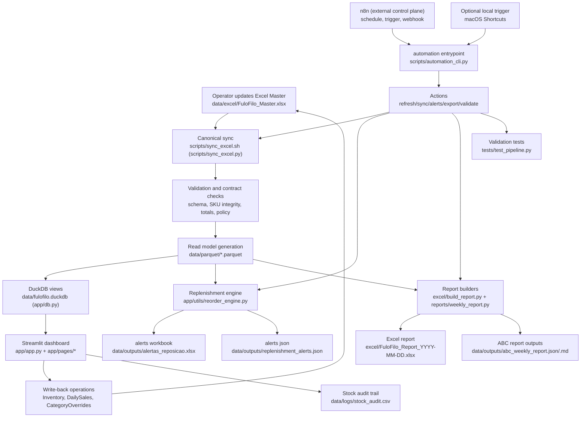

# FulôFiló Analytics — User Guide

_Last updated: 2026-05-15_

## 1. Source of truth and boundaries

Operational source of truth:

- `data/excel/FuloFilo_Master.xlsx`

Read models and artifacts (not operational sources):

- `data/parquet/*.parquet`
- `data/fulofilo.duckdb`
- `data/raw/catalogs/product_catalog.csv`
- `excel/FuloFilo_Report_*.xlsx`
- `data/outputs/*.json`

Orchestration boundary:

- n8n is allowed to orchestrate triggers/schedules/webhooks/retries.
- Business logic must stay in Python modules/scripts.

## 2. Complete pipeline (Mermaid)



## 3. Daily workflow

1. Register daily sales manually in the app on `Operações Diárias`.
2. Click `Executar rotina automática` in the sidebar.
3. Review the dashboard outputs.
4. Use `Validar dados` in the sidebar when you need a stricter check.

## 4. n8n orchestration workflow

### 4.1 Start n8n locally

```bash
cd /Users/eduardofgiovannini/Documents/GitHub/fulofilo-analytics
docker compose -f docker-compose.n8n.yml up -d
```

UI: [http://localhost:5678](http://localhost:5678)

### 4.2 Start local webhook bridge

```bash
cd /Users/eduardofgiovannini/Documents/GitHub/fulofilo-analytics
export FULOFILO_AUTOMATION_TOKEN="change-this-token"
make automation-webhook
```

Health endpoint:

- `GET http://127.0.0.1:8787/health`

Run endpoint:

- `POST http://127.0.0.1:8787/run`
- Auth header:
  - `X-Automation-Token: <token>` or
  - `Authorization: Bearer <token>`

### 4.3 Import sample workflow

Import this file in n8n:

- `docs/n8n/fulofilo_orchestration_workflow.json`

## 5. Automation commands (independent execution)

```bash
make automation-refresh-dashboard-data
make automation-sync-excel-master
make automation-generate-replenishment-alerts
make automation-export-reports
make automation-validate-data-integrity
```

Direct CLI example:

```bash
.venv/bin/python3 scripts/automation_cli.py refresh-dashboard-data
```

Main automatic routine:

```bash
make automation-run-daily
```

## 6. Idempotency, logs, and failure handling

- Idempotency state:
  - `data/automation/idempotency_state.json`
- Action locks:
  - `data/automation/locks/*.lock`
- Automation logs:
  - `logs/automation/*.log`
- Sync health:
  - `data/excel/source_sync_status.json`

If a command fails, read the corresponding `logs/automation/<action>.log`.

## 7. Production safety checklist

1. Back up workbook before major edits.
2. Keep `Meta` keys `schema_version` and `workbook`.
3. Run `make automation-validate-data-integrity` before trusting KPIs.
4. Confirm dashboard loads and KPIs are populated.
5. Never commit credentials/secrets.

## 8. Legacy notice

Historical CSV/JSON files remain in the repo for audit history.
They are not active write targets in the current pipeline.
